## Welcome to R-Ladies Nashville

## Github

All of our slides will be hosted on our github:
https://github.com/rladies-nashville
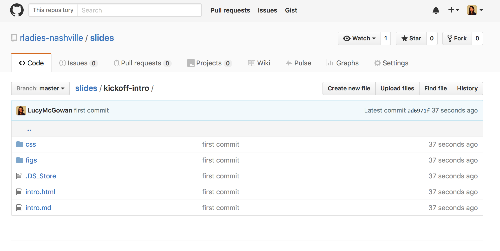

## What we've been doing

 
 
## R-Ladies Global

## How you can link into the Community

- Meetup: [www.meetup.com/rladies-nashville/](https://www.meetup.com/rladies-nashville/)
- Twitter: [RLadiesNash](https://twitter.com/rladiesnash) & [RLadiesGlobal](https://twitter.com/rladiesglobal)
- Github: [www.github.com/rladies-nashville](https://github.com/rladies-nashville)
- Website: [www.rladies.org](http://www.rladies.org)
- Speaker Directory: [www.rladies.org/r-speakers/](https://rladies.org/r-speakers/)

## Where we are now?

## R Foundation Women in R Taskforce

*Taskforce on Women in R* Di Cook, WSDS 2016

> to improve the participation and experience of women in the R community

<table id="nogrid">
<tr>
<td style="width:130px"></td>
<td>Jenny Bryan CA</td>
<td></td>
<td> Alicia Oshlack AU</td>
<td></td>
<td> Oliver Keyes US</td>
</tr>

<tr>
<td>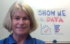</td>
<td> Di Cook AU</td>
<td>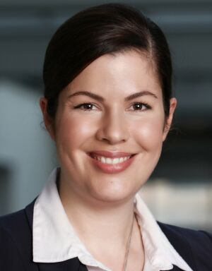</td>
<td> Carolin Strobl CH</td>
<td></td>
<td> Kevin O'Brien IE</td>
</tr>

<tr>
<td></td>
<td>Julie Josse FR</td>
<td>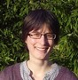</td>
<td> Heather Turner UK</td>
<td></td>
<td> Michael Lawrence US</td>
</tr>
</table> 

## Information Central: Website/GitHub

*Taskforce on Women in R* Di Cook, WSDS 2016

- http://forwards.github.io/
    - Summary of where we are
    - Events calendar
    - Data and code for gender summaries
    - Links to resources on diversity in tech
    - Slides from talks
    - More as initiative develops!

<iframe data-src="http://forwards.github.io/" height = 500 width = 650></iframe>

  

## 2010 Survey of Packages

*Taskforce on Women in R* Di Cook, WSDS 2016

- 2010 survey of 1087 maintainers of packages on CRAN/Bioconductor plus contributors on 
R-forge&#185;
- 9% of package authors were women (95% CI: 7.1 - 11.0%)
- 32.5% were from the USA

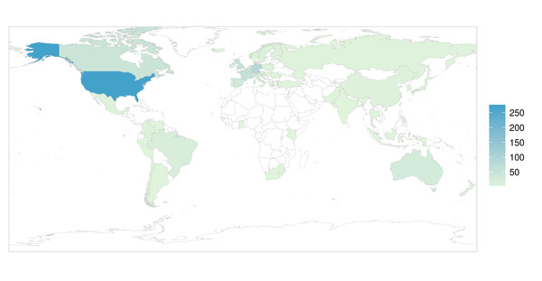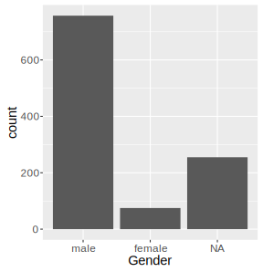
<small>&#185;Mair, P., Hofmann, E., Gruber, K., Hatzinger, R., Zeleis, A. and Hornik, K. (2015) Motivation, values, and work design as drivers of participation in the R open source project for statistical computing, Proc Nat. Acad. Sci.</small>

## Conferences

*Taskforce on Women in R* Di Cook, WSDS 2016

- useR! has already been working to improve diversity
    - gradual increase in number of female keynotes
    - code of conduct introduced in 2015
    - diversity scholarships & mothers' room in 2016
    
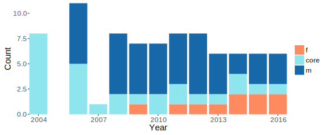

## useR! 2015 

*Taskforce on Women in R* Di Cook, WSDS 2016

- [http://user2015.math.aau.dk](http://user2015.math.aau.dk)
- ~19% participants were women
- ~20% of presentations

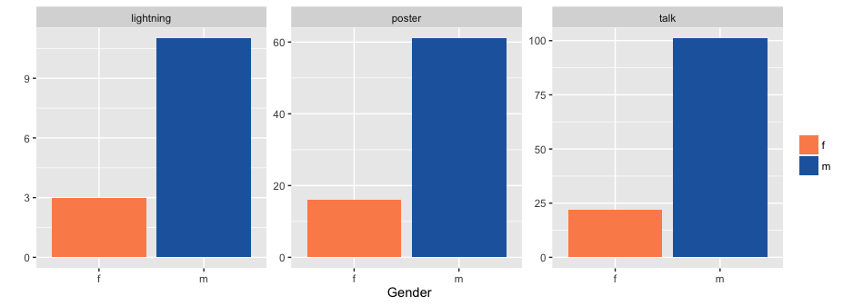

## R Packages

*Taskforce on Women in R* Di Cook, WSDS 2016

 - All CRAN maintainers (Mar 2016) processed with **genderizer**
    - uses databases to predict gender from first name
 - Supplemented by manual assignment
 - 14.8% package authors "female", 11.4% with P(gender) &ge; 0.8
 
 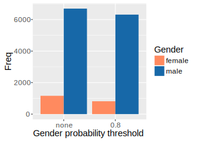

## Where should we be?

## US Students

*Taskforce on Women in R* Di Cook, WSDS 2016

 - US National Center for Education Statistics (2013-14)
 - Computer science ranges from 18% (Bachelor's) to 29% (Master's) female
 - Others range from 29% to 58% female
 
 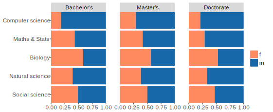
 
## US Occupations

*Taskforce on Women in R* Di Cook, WSDS 2016

 - Data from American Community Survey 2014
 - 22% female programmers
 - Other scientific/analytic occupations at least 41% female
 
  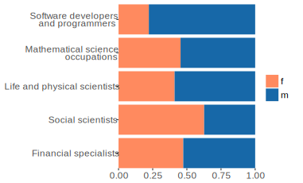
  
## Goals for R Community

*Taskforce on Women in R* Di Cook, WSDS 2016

 - Developers (CRAN maintainers, GSoC students, ISC funding holders) should at 
 least be comparable to computer science figures
    - &gt; 20% women
 - Broader user community (R conference attendees/speakers, RUG members) should at least be comparable to mathematical/natural sciences
    - 30-40% women
    
     
 
## How can we get there?

*Taskforce on Women in R* Di Cook, WSDS 2016

 

- Keep data
- Build developer capacity
- Community support

 

## Data Monitoring

*Taskforce on Women in R* Di Cook, WSDS 2016

 

<table style = "border-bottom: 3px solid #ddd !important">

<tr style = "border-bottom: 3px solid #ddd !important">
<td></td>
<td> **Details** </td>
<td> **Done** </td>
<td> **To Do** </td>
</tr>

<tr>
<td>useR!</td>
<td>attendees, invited speakers, presenters (talk/lightning/poster), chairs, committee members (local/program)</td>
<td>2015</td>
<td>2004-2014</td>
</tr>

<tr>
<td>packages</td>
<td>CRAN maintainers/authors, others?</td>
<td>maintainers</td>
<td>authors</td>
</tr>

<tr>
<td>GSoC</td>
<td>students, mentors</td>
<td>2015</td>
<td>2008-2014</td>
</tr>

<tr>
<td>ISC projects</td>
<td>proposers</td>
<td>funded</td>
<td>rejected?</td>
</tr>

<tr>
<td>R Journal</td>
<td>editors, authors </td>
<td>editors</td>
<td>authors</td>
</tr>

</table> 

 

## Conferences

*Taskforce on Women in R* Di Cook, WSDS 2016

* The taskforce made recommendations for useR! 2016 <small>  </small>
<table style = "border-bottom: 3px solid #ddd !important"><tr style = "border-bottom: 3px solid #ddd !important"><td> **Recomendation** </td><td> **Action** </td></tr><tr><td>50:50 program committee </td><td>7:6 female:male</td></tr><tr><td>50:50 session chairs</td><td>7:18</td></tr><tr><td>&ge; 20% women on panels</td><td>NA</td></tr><tr><td>put gender stats on website</td><td>not done</td></tr></table>
  
* Future useR!s
     - maintain current gender balance for invited speakers
     - aim for similar gender balance for tutorials: 28% had female tutor in 2015
- useR! 2017 proposal includes offering childcare

    
## Summary

*Taskforce on Women in R* Di Cook, WSDS 2016

- Women are under-represented in both user and developer communities
    - Users ~ 20% women; goal 30-40% women
    - Developers ~ 10% women; goal 20% women
- Women in R Taskforce has been established to address this
    - Current focus: data gathering, communications
    - Future work: outreach

     

@RWomenTaskforce

http://forwards.github.io/

## What you can do
 

- Plug into the community 
    - rladies.org, @RLadiesNash, @RLadiesGlobal
- Spread the news
- Mentor/be mentored by other women
- **Help us make R Ladies Nashville a success!**
    