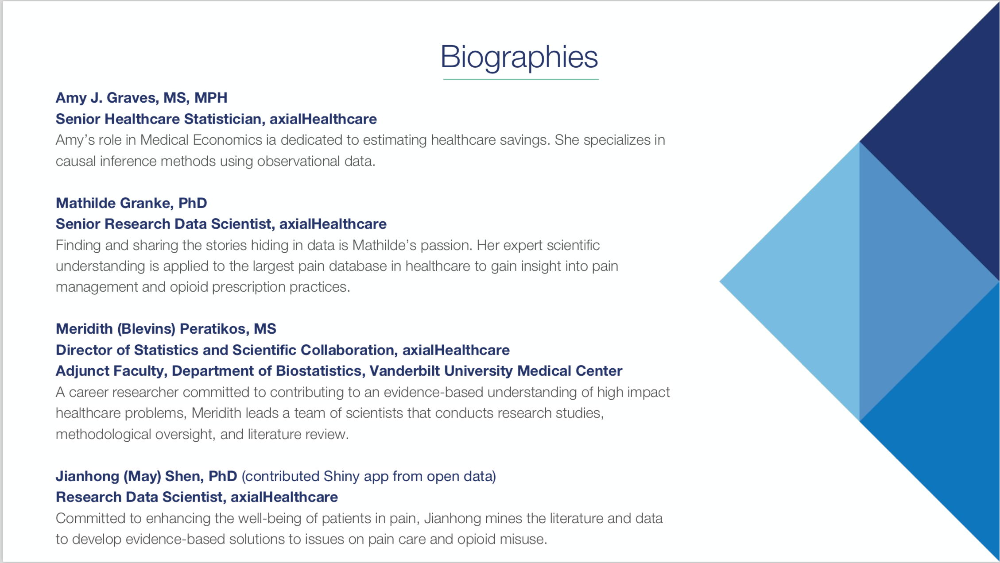

# December 2018 Meetup: Data Science Workflows with R

## Speakers: Amy Graves, Mathilde Granke, Meridith Peratikos, with contributions from May Shen, all of [Axial Healthcare](https://www.axialhealthcare.com/)

## [Link to slides (PDF)](2018-12-10_datasci_workflows.pdf)

## Sections

1. Database connections and querying with dplyr and data.table (Amy Graves)
1. Creating attractive and informative map visualizations in R (Mathilde Granke)
1. Subject Matter Expertise and RStudio Enterprise (Meridith Blevins Peratikos)

May Shen's reproducible, public examples for some of these topics: [github.com/mayjh/r-ladies-demo](https://github.com/mayjh/r-ladies-demo)